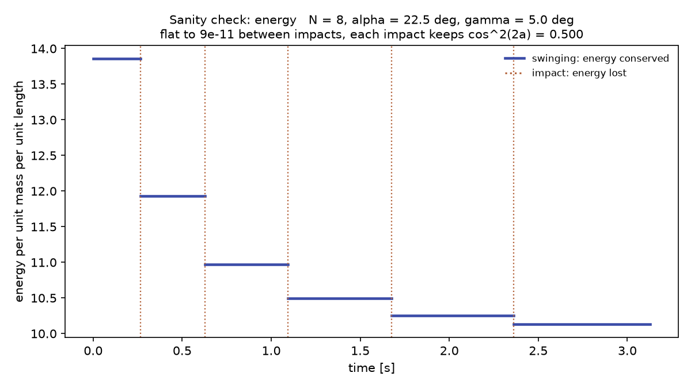
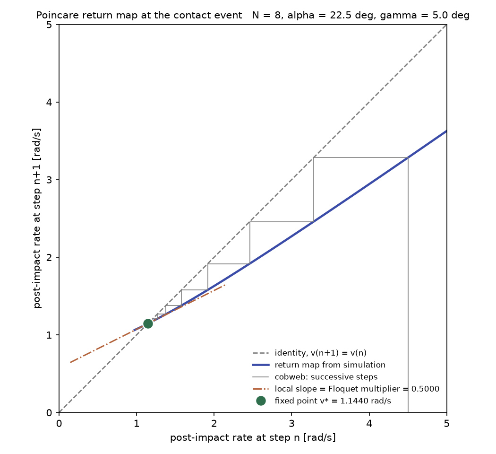
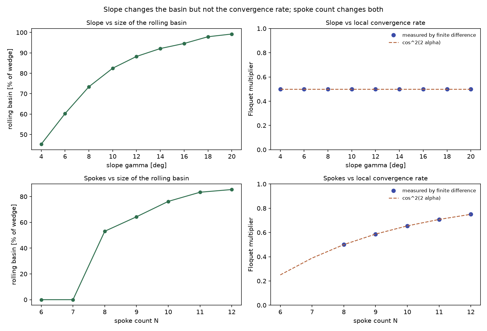
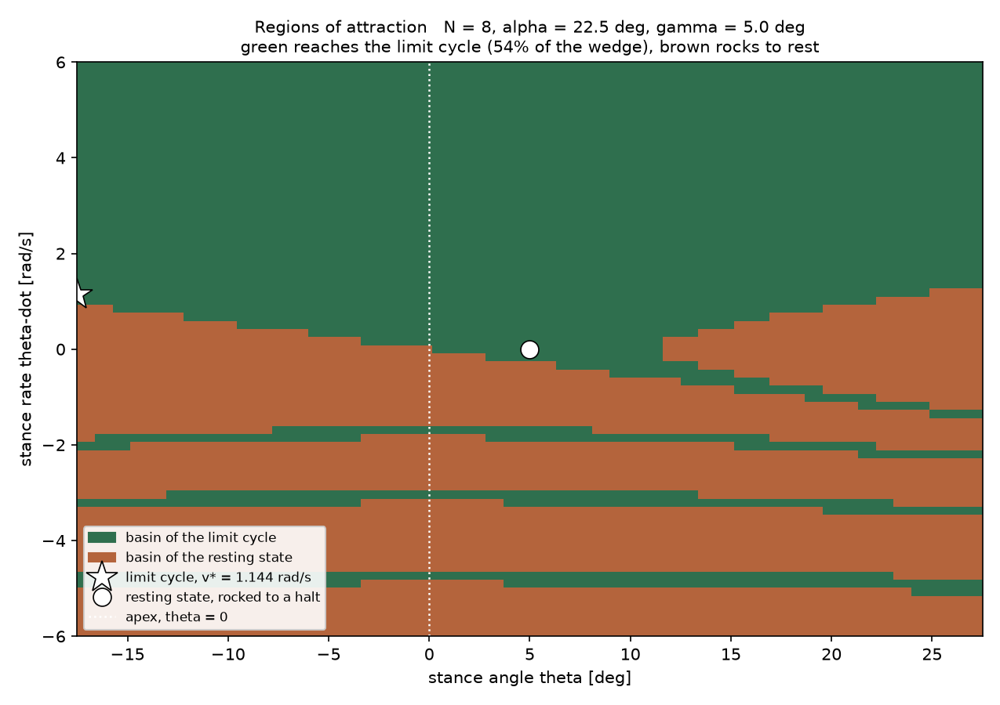

## Running Instructions
'''
cd MAE5110CodeAssignments
uv add numpy scipy matplotlib
uv run python assignments/assignment_1/stability_analysis.py
'''

## Model Sanity Checks

In this modelling of a rimless wheel system, I included a sanity check to check the total energy in the system over time to see how
the collissions affected the system. From what we know of the rimless wheel system, we know that it has plastic collsiions for every spoke that hits the slope. This means that we should expect the system to lose energy on every collision. From the plot, we see that the total energy in the system decreases asymptotically every collision.
  

## Return Map Plot
Return Map Plot with fixed point and identity line shown.
  

## Sweeps

  

## Regions of Attraction

## Spokes and Slope affecting RoA and local convergence.

From the sweeps plot, we can see how the slope angle affects the RoA because an increase in the slope angle increases the percentange of rimless wheels that end up rolling continuously in a limit cycle. From 4 deg having 45% to 20 deg having 99%, there is a significant positive correlation between the slope angle and the RoA percentage. For the number of spokes, we see that there is a similar positive correlation except that rimless wheels with 7 or below number of spokes have a 0% for the RoA. The issue for these two spoke numbers is that the rimless wheel loses too much energy and speed compared to the speed it needs to move to the next spoke. 

From the sweeps plot, we see that there is no correlation between the slope angle and the local convergence rate. This is because the slope affects the energy regained from potential energy due to gravity which is not related to how the wheel recovers from disturbances. However, there is a positive correlation between the number of spokes and the local convergence rate, which is because more spokes reduces the energy lost making it easier and more forgiving to recover from disturbances.